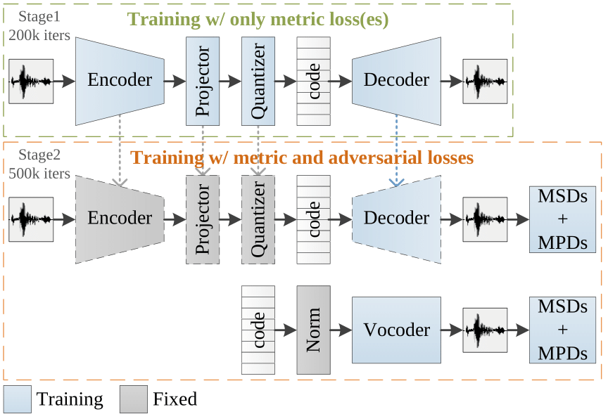

# AudioDec: An Open-source Streaming High-fidelity Neural Audio Codec

<I> Yi-Chiao Wu, Israel D. Gebru, Dejan Marković, and Alexander Richard </I>
 

 Meta Reality Labs Research, USA 
   

This page is the demo of AudioDec [[paper](https://ieeexplore.ieee.org/document/10096509)] [[code](https://github.com/facebookresearch/AudioDec)]  

## **Abstract**  

 A good audio codec for live applications such as telecommunication is characterized by three key properties: (1) compression, i.e. the bitrate that is required to transmit the signal should be as low as possible; (2) latency, i.e. encoding and decoding the signal needs to be fast enough to enable communication without or with only minimal noticeable delay; and (3) reconstruction quality of the signal. In this work, we propose an open-source, streamable, and real-time neural audio codec that achieves strong performance along all three axes: it can reconstruct highly natural sounding 48 kHz speech signals while operating at only 12 kbps and running with less than 6 ms (GPU)/10 ms (CPU) latency. An efficient training paradigm is also demonstrated for developing such neural audio codecs for real-world scenarios. 

## **Architecture**  

  

  
## **Demo Sounds**
- VCTK (***fs***: 48 kHz) (codec bitrate: 12.8 kbps)

| Codec | Female (p257_035) | Male (p232_400) |
|:--|:--:|:--:|
| Natural | <audio src="res/audio/vctk48k_female/Natural/p257_035.wav" controls preload></audio> | <audio src="res/audio/vctk48k_male/Natural/p232_400.wav" controls preload></audio> |
| SoundStream (reimplement) | <audio src="res/audio/vctk48k_female/SS/p257_035.wav" controls preload></audio> | <audio src="res/audio/vctk48k_male/SS/p232_400.wav" controls preload></audio> |
| symAD | <audio src="res/audio/vctk48k_female/symAD/p257_035.wav" controls preload></audio> | <audio src="res/audio/vctk48k_male/symAD/p232_400.wav" controls preload></audio> |
| symAD* | <audio src="res/audio/vctk48k_female/symAD_/p257_035.wav" controls preload></audio> | <audio src="res/audio/vctk48k_male/symAD_/p232_400.wav" controls preload></audio> |
| asymAD | <audio src="res/audio/vctk48k_female/asymAD/p257_035.wav" controls preload></audio> | <audio src="res/audio/vctk48k_male/asymAD/p232_400.wav" controls preload></audio> |
| AudioDec v0 | <audio src="res/audio/vctk48k_female/ADv0/p257_035.wav" controls preload></audio> | <audio src="res/audio/vctk48k_male/ADv0/p232_400.wav" controls preload></audio> |
| **AudioDec v1** | <audio src="res/audio/vctk48k_female/ADv1/p257_035.wav" controls preload></audio>   | <audio src="res/audio/vctk48k_male/ADv1/p232_400.wav" controls preload></audio>   |
| AudioDec v2 | <audio src="res/audio/vctk48k_female/ADv2/p257_035.wav" controls preload></audio> | <audio src="res/audio/vctk48k_male/ADv2/p232_400.wav" controls preload></audio> |

symAD: `symmetric AudioDec (autoencoder)`   
sumAD*: `symAD w/o fixing the encoder during the adversarial training`   
asymAD: `asymmetric AudioDec (asymmetric autoencoder)`   
AudioDec v0: `AudioDec w/ HiFi-GAN vocoder`   
**AudioDec v1**: `the proposed AudioDec (encoder + multi-group vocoder)`   
AudioDec v2: `smaller AudioDec (encoder + smaller multi-group vocoder)` 

- LibriTTS (***fs***: 24 kHz) (codec bitrate: 6.4 kbps)

| Codec | Female1 | Male1 |
|:--|:--:|:--:|
| Natural | <audio src="res/audio/libritts24k_female/Natural/1995_1826.wav" controls preload></audio> | <audio src="res/audio/libritts24k_male/Natural/2300_131720.wav" controls preload></audio> |
| symAD | <audio src="res/audio/libritts24k_female/symAD/1995_1826.wav" controls preload></audio> | <audio src="res/audio/libritts24k_male/symAD/2300_131720.wav" controls preload></audio> |
| **AudioDec v1** | <audio src="res/audio/libritts24k_female/ADv1/1995_1826.wav" controls preload></audio>   | <audio src="res/audio/libritts24k_male/ADv1/2300_131720.wav" controls preload></audio>   |

| Codec | Female2 | Male2 |
|:--|:--:|:--:|
| Natural | <audio src="res/audio/libritts24k_female/Natural/3729_6852.wav" controls preload></audio> | <audio src="res/audio/libritts24k_male/Natural/8224_274384.wav" controls preload></audio> |
| symAD | <audio src="res/audio/libritts24k_female/symAD/3729_6852.wav" controls preload></audio> | <audio src="res/audio/libritts24k_male/symAD/8224_274384.wav" controls preload></audio> |
| **AudioDec v1** | <audio src="res/audio/libritts24k_female/ADv1/3729_6852.wav" controls preload></audio>   | <audio src="res/audio/libritts24k_male/ADv1/8224_274384.wav" controls preload></audio>   |

## **Speech Quality Measurments** 

  

## **Latency Analysis (ms)** 
- GPU: NVIDIA GeForce RTX3090

- CPU: AMD Ryzen Threadripper 3970X w/ 4 threads

  
  

##  Liability Disclaimer

The demo page utilizes public speech datasets (<a href="https://datashare.ed.ac.uk/handle/10283/3443">VCTK</a> and <a href="https://www.openslr.org/60/">LibriTTS</a>) for demonstration purposes only, and we do not claim ownership over these speech samples. The Content of the demo files is provided "as is" and for general informational purposes only. We make no warranties regarding its accuracy or suitability. If you believe that any speech samples infringe upon your rights or violate any laws, please contact us to remove the demo files. We are not liable for any damages arising from the use or reliance on the Content on our demo page or open-source code. By accessing the demo page and using the Content, you agree to release us from any claims or liabilities related to its use. 

  

[Home](https://bigpon.github.io/)

   
   